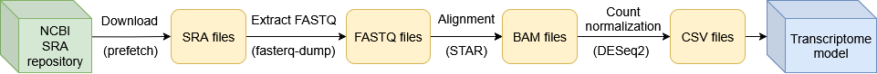
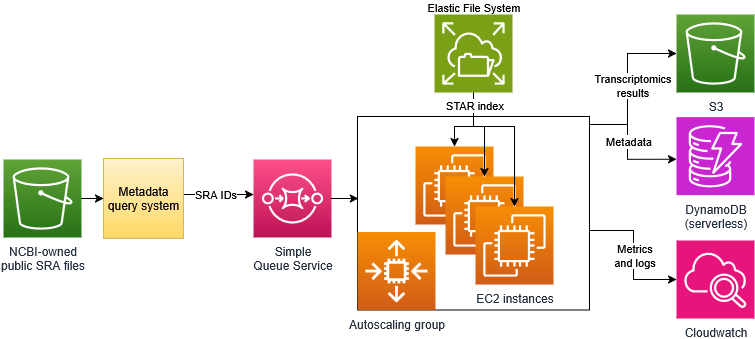

# NearData Transcriptomics Atlas 
Transcriptomics Atlas pipeline is a data- and compute-intensive pipeline, based on a sequence aligner – STAR – that processes tens or hundreds of terabytes of RNA-seq data.

---
### Pipeline:

The Transcriptomics Atlas pipeline consists of four steps:
1) Downloading SRA file using prefetch tool.
2) Converting into FASTQ file using fasterq-dump tool.
3) Alignment of reads using STAR.
4) Count normalization using DESeq2.

### Cloud Architecture:
 

--- 
### Optimizations:  
- Early stopping for STAR alignment
  - [analysis notebook](TranscriptomicsAtlas/analysis/STAR/STAR_early_stopping/early_stopping_analysis.ipynb)
- Ensembl Genome: Release 108 versus Release 111
  - [analysis notebook](TranscriptomicsAtlas/analysis/STAR/STAR_release_108_vs_111/release_analysis.ipynb)  
- Spot instances 
  - cheaper compute
- Optimized instance type
  - r7a.2xlarge (cost-efficient and fast)
  - [analysis notebook](TranscriptomicsAtlas/analysis/STAR/Instance_types/STAR_instance_type_analysis.ipynb)
- Index distribution solution
  - EFS (efficient and better than alternatives)
- Scalability of STAR 
  - 8 cores per node (cost-efficient core allocation)
  - [analysis notebook](TranscriptomicsAtlas/analysis/STAR/Scalability/STAR_scalability_analysis.ipynb)
- Evaluation of serverless applicability
  - Less cost-efficient and slower than r7a.2xlarge
  - Too heavy for Lambda, only ECS Fargate possible
  - [analysis notebook](TranscriptomicsAtlas/analysis/STAR/Fargate/STAR_fargate_analysis.ipynb)

## Publications
> Bader, Jonathan, et al. "Novel Approaches Toward Scalable Composable Workflows in Hyper-Heterogeneous Computing Environments." Proceedings of the SC'23 Workshops of The International Conference on High Performance Computing, Network, Storage, and Analysis. 2023.  
> DOI:  https://doi.org/10.1145/3624062.3626283

> Kica, P., Lichołai, S., Orzechowski, M., & Malawski, M. (2024, September). Optimizing Star Aligner for High Throughput Computing in the Cloud. In 2024 IEEE International Conference on Cluster Computing Workshops (CLUSTER Workshops) (pp. 162-163). IEEE.  
> DOI: https://doi.org/10.1109/CLUSTERWorkshops61563.2024.00039

> Kica, P., Orzechowski, M., & Malawski, M. (2025, May). Serverless Approach to Running Resource-Intensive STAR Aligner. In 2025 IEEE 25th International Symposium on Cluster, Cloud and Internet Computing Workshops (CCGridW) (pp. 1-4). IEEE.  
> DOI: https://doi.org/10.1109/CCGridW65158.2025.00039

> Kica, P., Lichołai, S., Orzechowski, M., & Malawski, M. (2025, July). Accelerating Cloud-Based Transcriptomics: Performance Analysis and Optimization of the STAR Aligner Workflow. In International Conference on Computational Science (pp. 257-265). Cham: Springer Nature Switzerland.  
> DOI: https://doi.org/10.1007/978-3-031-97635-3_31

## License
This project is licensed under the [MIT License](LICENSE).

## Acknowledgements
This project has received funding from the European Union's Horizon 2020 research and innovation programme under grant agreement No 101092644.