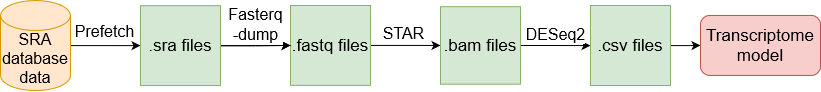
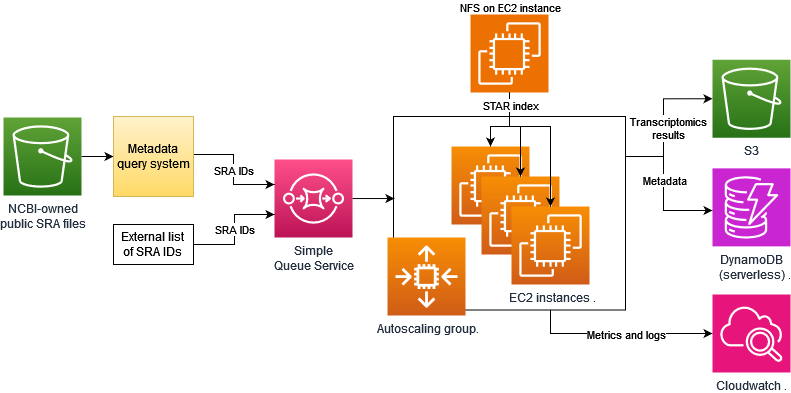

# Transcriptomics Atlas Project  
Transcriptomics Atlas pipeline is a data- and compute-intensive pipeline, based on a sequence aligner – [STAR](https://github.com/alexdobin/STAR)
– that processes tens or hundreds of terabytes of RNA-seq data. 

---
### Pipeline:

The Transcriptomics Atlas pipeline consists of four steps:
1) Downloading SRA file using prefetch tool.
2) Converting into FASTQ file using fasterq-dump tool.
3) Alignment of reads using STAR.
4) Count normalization using DESeq2.

### Architecture:

--- 

### Optimizing STAR Aligner for High Throughput Computing in the Cloud:  
Early stopping for STAR alignment - [analysis notebook](TranscriptomicsAtlas/analysis/STAR/STAR_early_stopping/early_stopping_analysis.ipynb)  
Ensembl Genome: Release 108 versus Release 111 - [analysis notebook](TranscriptomicsAtlas/analysis/STAR/STAR_release_108_vs_111/release_analysis.ipynb)

---

### Publications:
*Optimizing STAR Aligner for High Throughput Computing in the Cloud* - Kica Piotr, Lichołai Sabina, Orzechowski Michał, Malawski Maciej - Accepted poster at [Cluster2024 conference](https://clustercomp.org/2024/). 

### Acknowledgements:
The research was carried out within the project of the Minister of Science and Higher Education "Support for the activity of Centers of Excellence 
established in Poland under Horizon 2020" on the basis of the contract number MEiN/2023/DIR/3796. This project has received funding from the European 
Union’s Horizon 2020 research and innovation programme under grant agreement No 857533. The research is supported by Sano project carried out within 
the International Research Agendas programme of the Foundation for Polish Science, co-financed by the European Union under the European Regional 
Development Fund. The research is supported by the European Union’s Horizon Europe research and innovation programme under grant 
agreement NEARDATA No 101092644.
